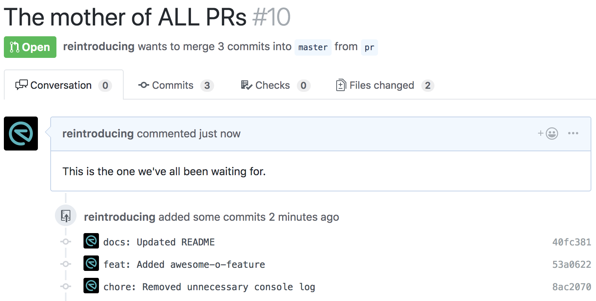
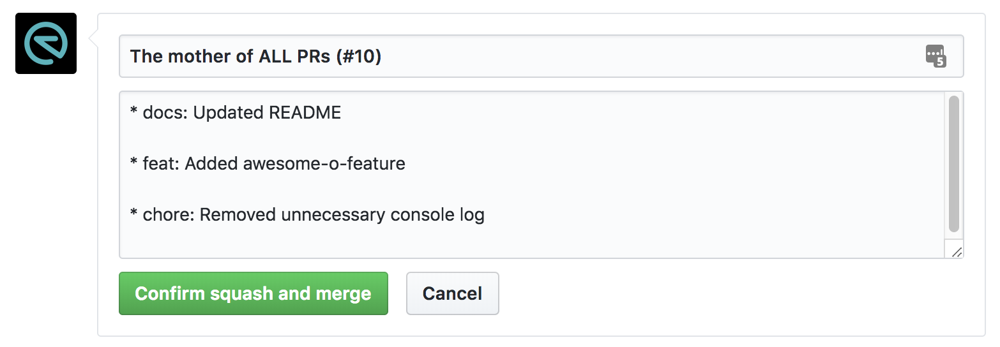
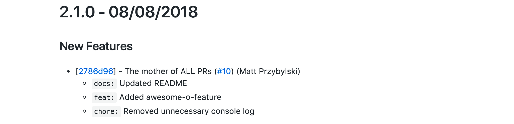
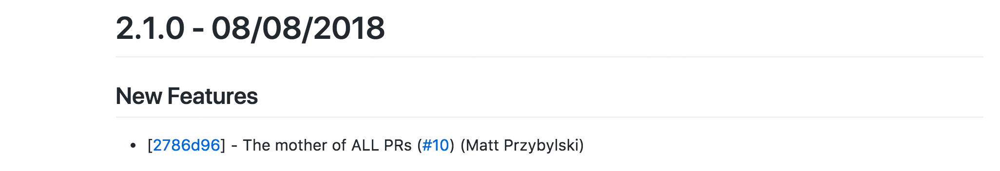

# @spothero/npm-publisher
This module aids in development and publishing of modules to an npm registry in public or private mode.

## What Does It Do?
1. Automatically creates a `CHANGELOG.md` file based on [commit conventions](https://github.com/spothero/commitlint-config#commit-conventions).
1. Automatically determines and bumps the version of the package (in `package.json`) accordingly based on [the commit conventions](https://github.com/spothero/commitlint-config#important-considerations).
1. Publishes the package to the npm registry.
1. Pushes a tag to Git with the new version number to your configured repository (see below for configuration options).
1. Notifies a messaging service of the new release (see below for configuration options).

## Prerequisites
* Node and npm installed on your machine.
    * [nvm](https://github.com/creationix/nvm) is highly recommended.
* [Logged in](https://docs.npmjs.com/cli/adduser) to your npm account.

## Usage
Please ensure that you follow directions **exactly** for this module to function correctly.

* Create a GitHub repository for your project and clone it.
* Initialize npm in your project and fill out the information accordingly.
    ```
    npm init
    ```
* Install the module into your project:
    ```
    npm i @spothero/npm-publisher -D
    ```
* Ensure your `package.json` file has the following fields:
    ```
    "repository": "[https url to your repository here, eg: https://github.com/spothero/npm-publisher]",
    "scripts": {
        ...,
        "release": "npm-release"
    }
    ```
    * Note that the string https form of `repository` is preferred, however the tool will do its best to accommodate the object form as well.
* By default, the publish settings of scoped packages (@spothero namespace) are private. If you want it to be public update the `release` script to the following:
    ```
    "scripts": {
        ...,
        "release": "npm-release -- public"
    }
    ```
* Optionally add a configuration file for additional features (see below).
* When you're ready to create a new release/publish, run the following:
    ```
    npm run release
    ```

## Configuration
Additional features can be unlocked by providing a `.npmpublisherrc` file. This should be a JSON formatted file and can live at either of the following locations (ordered by precedence):

1. At the root of your module.
    ```
    /.npmpublisherrc
    ```
1. In your home directory (preferred).
    ```
    $HOME/.npmpublisherrc
    ```

<span style="color: #ff0000;">**NOTE: Because this file will usually contain sensitive data, it is encouraged to keep it out of public repositories and in your home directory.**</span>

The rc file should contain a similar configuration to the following:
```
{
    "spothero": { // <---- scope, i.e. @spothero/[package]
        "github": {
            "accessToken": "..."
        },
        "slack": {
            "channelId": "...",
            "botUserToken": "..."
        }
    },
    "otherscope": { // <---- scope, i.e. @otherscope/[package]
        "github": {
            "accessToken": "..."
        },
        "hipchat": {
            "apiRoot": null,
            "authToken": "...",
            "roomToken": "...",
            "roomName": "..."
        }
    },
    "default": null
}
```

You can have multiple `scope` entries which allows you to have configuration settings for different npm organizations. You can [read more about scopes here](https://docs.npmjs.com/misc/scope). The scopes defined here will map to your project scope which helps support publishing without the need for putting the rc file in multiple directories.

**NOTE: The name of the scope is automatically pulled from the package you are publishing using its `name` field in package.json.**

If you don't have a scope and want to use a default configuration for all publishes, the same configuration setup can be applied to the `default` key.

If no configuration is specified, the additional features will not be executed. You can specify all of the keys or only a subset to unlock the features you wish to use.

The currently available features are listed below.

### Publish release to GitHub
By providing the `accessToken` in the `github` key, you can automatically publish a release to your project's GitHub account (as specified in the package.json file). You will need to create a [Personal access token](https://github.com/settings/tokens) on GitHub. We also suggest setting up a "bot" user and inviting them to your organization so that multiple people can use the same token and it won't be tied to your personal account.

### Notify a Slack channel
By setting a `channelId` and providing a `botUserToken`, you can notify a Slack channel of your publish. You'll also need to create a Slack app and install it in your Slack workspace to aid in publishing to your channel.

* [Get Slack channel ID](https://www.wikihow.com/Find-a-Channel-ID-on-Slack-on-PC-or-Mac)
* [Slack Apps](https://api.slack.com/apps)
* [Creating a Slack bot user](https://api.slack.com/bot-users#creating-bot-user)

## Notify a HipChat room
By adding an `authToken`, `roomToken`, and `roomName` in the `hipchat` key, you can notify a HipChat room of your publish. You'll need to generate the appropriate tokens and add the "BYO" integration to your room. You can also optionally pass an `apiUrl` if it differs from the default HipChat v2 API url.

* [HipChat tokens](https://developer.atlassian.com/server/hipchat/about-the-hipchat-rest-api/)

## Prereleases
You can add a prerelease to your publish command (`alpha`, `beta`, `rc`, etc...). The next appropriate version number will be calculated automatically for you.

As an example, if your package was on v1.0.0, and your next set of commits included a `feat` commit type:
```
NPM_PRERELEASE=beta npm run release // yields v1.1.0-beta.0
```
Running the command again, this time with a `chore` commit type, you publish again:
```
NPM_PRERELEASE=beta npm run release // yields v1.1.0-beta.1
```
And lastly, running the command again, with another `feat` commit type, you publish the non-prerelease version:
```
npm run release // yields v1.1.0
```

## Branches
When running a prerelease, you will likely be on a non-master branch. You can run the release command with BRANCH_NAME set:
```
NPM_PRERELEASE=beta BRANCH_NAME=my-branch npm run release
```
This will commit the changelog and package.json changes back to your branch. If no BRANCH_NAME is specified, npm-publisher will default to the master branch.

## Pull Requests & Changelog Generation
Oftentimes when you open a PR and commit more than once, you may end up with a number of commit messages that you want to be generated in the changelog when publishing.


The typical workflow is to use the `Squash and merge` button of the pull request which would result in the following:


There are a few options here:
### Confirm the merge
* Publisher will run through the commit.
* It will use the title of the PR as the main commit message (you can alter the title if you'd like).
* The [highest weighted commit type](https://github.com/spothero/commitlint-config#important-considerations) from the descriptions will be used and set that as the main commit type on the PR.
* The descriptions of the commits in the PR will be included as list items under the main PR commit.

*Generated Changelog Example 1*


### Alter title/descriptions
* If you only want the title to show up in the Changelog and don't care about the commit messages, you can safely delete them.
* The commit type on the title will be used to generate the entry in the proper spot of the Changelog.
    * Make sure that the commit type you add is the highest weighted necessary to properly document the entry.
    * In this example, the title was altered to say `feat: The mother of ALL PRs (#10)`.
    * You can also remove the PR number [`(#10)`] portion in the title to not auto-link to the PR in the repo.

*Generated Changelog Example 2*


## Credits
This package is based on [eslint-release](https://github.com/eslint/eslint-release).
